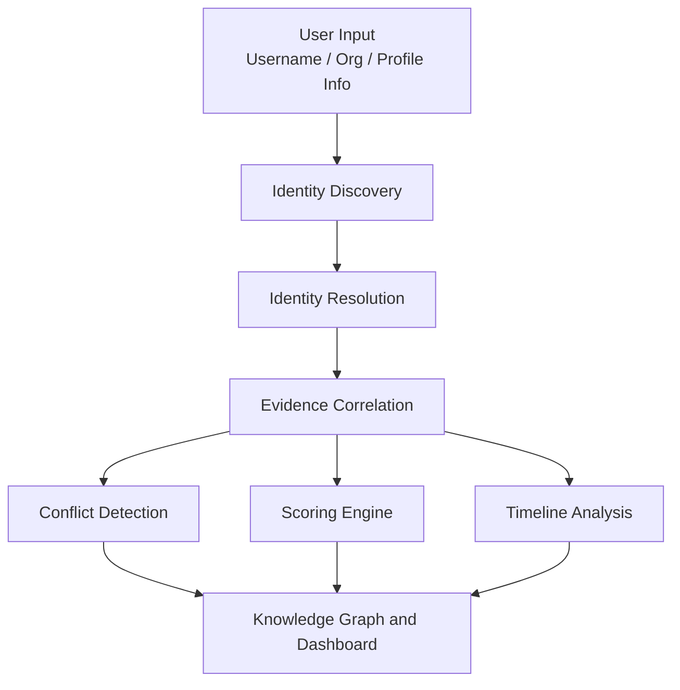

<div align="center">

# Digital Identity Intelligence System

**An AI-assisted platform for discovering, resolving, and analyzing public-source identity information across multiple online platforms.**


</div>

---

## Table of Contents

- [Overview](#overview)
- [Key Features](#key-features)
- [System Architecture](#system-architecture)
- [Project Structure](#project-structure)
- [Technology Stack](#technology-stack)
- [Installation](#installation)
- [Usage](#usage)
- [Core Modules](#core-modules)
- [Output](#output)
- [Screenshots](#screenshots)
- [Limitations](#limitations)
- [Roadmap](#roadmap)
- [Responsible Use](#responsible-use)
- [Contributing](#contributing)
- [License](#license)

---

## Overview

The system takes an identity input such as a **username**, **organization**, or **profile information** and builds a structured view of the discovered identity. It combines:

- Identity resolution
- Evidence correlation
- Conflict detection
- Confidence scoring
- Timeline analysis
- Knowledge-graph visualization

Instead of examining individual profiles manually, everything is brought together in a single interactive dashboard.

---

## Key Features

### Identity Discovery

Discovers publicly available identity information from supported online sources using identifiers such as:

- Username
- Organization
- Profile information
- Public-source records

### Identity Resolution

Analyzes discovered profiles and determines which records are likely associated with the same person, using signals such as:

| Signal | Description |
| --- | --- |
| Username similarity | How closely handles match across platforms |
| Name similarity | Agreement between display or legal names |
| Organization | Shared affiliations |
| Location | Consistency of stated locations |
| Roles | Matching titles or responsibilities |
| Projects | Overlapping repositories or work |
| Source agreement | Number of independent sources that corroborate a link |

### Evidence Correlation

Collects and organizes supporting information for a resolved identity:

- Profile records
- Source URLs
- Organizations
- Projects
- Publications
- Public identifiers

### Conflict Detection

Flags potentially inconsistent information across discovered records:

- Different names
- Different organizations
- Conflicting locations
- Conflicting roles
- Inconsistent profile information

### Confidence Scoring

Combines multiple evidence signals into an overall confidence score. Components include:

- Username Match
- Image Match
- Source Agreement
- Record Linkage
- Organization Match
- Evidence Strength
- Conflict Detection

### Knowledge Graph

Builds a relationship graph that connects identity entities. The graph is generated dynamically from the discovered data.

```text
Person
   |
   +-- Username
   +-- Profiles
   +-- Platforms
   +-- Organizations
   +-- Roles
   +-- Projects
   +-- Publications
   +-- Locations
```

### Identity Timeline

Displays dated identity activity and events to give a chronological view of the discovered information.

---

## System Architecture



<details>
<summary>Plain-text version of the diagram</summary>

```text
                 +---------------------+
                 |     User Input      |
                 | Username / Org /    |
                 | Profile Information |
                 +----------+----------+
                            |
                            v
                 +---------------------+
                 | Identity Discovery  |
                 +----------+----------+
                            |
                            v
                 +---------------------+
                 | Identity Resolution |
                 +----------+----------+
                            |
                            v
                 +---------------------+
                 | Evidence Correlation|
                 +----------+----------+
                            |
              +-------------+-------------+
              |             |             |
              v             v             v
       +------------+ +------------+ +------------+
       |  Conflict  | |  Scoring   | |  Timeline  |
       | Detection  | |   Engine   | |  Analysis  |
       +------+-----+ +------+-----+ +------+-----+
              |              |              |
              +--------------+--------------+
                             |
                             v
                 +---------------------+
                 | Knowledge Graph and |
                 |     Dashboard       |
                 +---------------------+
```

</details>

---

## Project Structure

```text
digital-intelligence-system/
|
+-- app.py                 # Streamlit dashboard and pipeline orchestration
+-- requirements.txt
+-- README.md
+-- .gitignore
|
+-- modules/
|   +-- __init__.py
|   +-- discovery.py       # Candidate record discovery
|   +-- resolver.py        # Record matching and resolution
|   +-- evidence.py        # Evidence organization
|   +-- conflict.py        # Inconsistency detection
|   +-- scorer.py          # Confidence scoring
|   +-- timeline.py        # Chronological event building
|   +-- graph_builder.py   # Knowledge graph construction and rendering
|   +-- ...
|
+-- generated/
    +-- identity_graph_*.png
```

---

## Technology Stack

| Technology | Purpose |
| --- | --- |
| Python | Core application |
| Streamlit | Interactive web interface |
| NetworkX | Knowledge graph construction |
| Matplotlib | Graph visualization |
| Pandas | Data processing |
| Git | Version control |
| GitHub | Source code repository |

---

## Installation

### Prerequisites

- Python 3.9 or newer
- Git

### 1. Clone the repository

```bash
git clone https://github.com/Nivedithakatta08/digital-intelligence-system.git
cd digital-intelligence-system
```

### 2. Create and activate a virtual environment

**Windows**

```bash
python -m venv venv
venv\Scripts\activate
```

**macOS / Linux**

```bash
python3 -m venv venv
source venv/bin/activate
```

### 3. Install dependencies

```bash
pip install -r requirements.txt
```

If `requirements.txt` is not available:

```bash
pip install streamlit networkx matplotlib pandas
```

### 4. Run the application

```bash
streamlit run app.py
```

The app opens in your browser, usually at `http://localhost:8501`.

---

## Usage

1. **Provide identity input.** Enter a username or other supported identity information.

   ```text
   Username: tanaypratap
   ```

2. **Analyze.** Click the `Analyze Identity` button.
3. **Discovery.** The system collects available public-source profile information.
4. **Resolution.** Candidate profiles are compared and related records are linked.
5. **Evidence analysis.** Supporting evidence is collected and organized.
6. **Risk and confidence analysis.** Confidence is calculated from available signals, and conflicting information is flagged.
7. **Visualization.** The dashboard presents:
   - Identified Person
   - Source Coverage
   - Confidence Score
   - Knowledge Graph
   - Identity Timeline
   - Evidence Components
   - Conflict Detection
   - Resolved Profile
   - Other Candidates

---

## Core Modules

| Module | Responsibility |
| --- | --- |
| `discovery.py` | Discovers candidate identity records from supported sources |
| `resolver.py` | Matches and resolves candidate records using identity attributes |
| `evidence.py` | Organizes supporting evidence for discovered identities |
| `conflict.py` | Detects inconsistencies between identity records |
| `scorer.py` | Calculates confidence from multiple identity signals |
| `timeline.py` | Builds a chronological representation of identity events |
| `graph_builder.py` | Constructs and renders the knowledge graph with NetworkX and Matplotlib |
| `app.py` | Streamlit dashboard that coordinates the full analysis pipeline |

---

## Output

The system produces a structured identity analysis:

```text
Identity
|
+-- Source Coverage
+-- Resolved Profile
+-- Confidence Score
+-- Evidence
+-- Conflicts
+-- Timeline
+-- Related Profiles
+-- Knowledge Graph
```

The knowledge graph shows relationships between the resolved identity and discovered entities such as platforms, usernames, organizations, projects, publications, and locations. Generated graph images are saved to the `generated/` folder.

---

## Screenshots

> Add screenshots here to make the project easier to evaluate.

| Dashboard | Knowledge Graph |
| --- | --- |
|  |  |

---

## Limitations

- Results depend on the public sources supported by the discovery module. Coverage is not exhaustive.
- Confidence scores are heuristic. They indicate likelihood, not proof of identity.
- Common names and usernames can produce false matches, so results should be reviewed by a human.
- Public profile data may be outdated, incomplete, or intentionally inaccurate.

---

## Roadmap

- [ ] Add support for more public data sources
- [ ] Export reports as PDF or JSON
- [ ] Add configurable weights for scoring components
- [ ] Add unit tests for resolver, scorer, and conflict modules
- [ ] Improve image-based matching
- [ ] Add caching and rate-limit handling for source requests

---

## Responsible Use

This project is intended for **educational, research, and authorized public-source intelligence** use.

The system should only process information that is legally accessible and appropriate to use. It must **not** be used to:

- Obtain private information
- Bypass access controls
- Impersonate individuals
- Facilitate harassment or unauthorized surveillance

Users are responsible for complying with the terms of service of each data source and with applicable privacy laws.

---

## Contributing

Contributions are welcome.

1. Fork the repository
2. Create a feature branch: `git checkout -b feature/your-feature`
3. Commit your changes: `git commit -m "Add your feature"`
4. Push the branch: `git push origin feature/your-feature`
5. Open a pull request

---

## License

This project is intended as an academic and hackathon project. Add an appropriate open-source license (for example MIT or Apache-2.0) as a `LICENSE` file before distributing it publicly.
