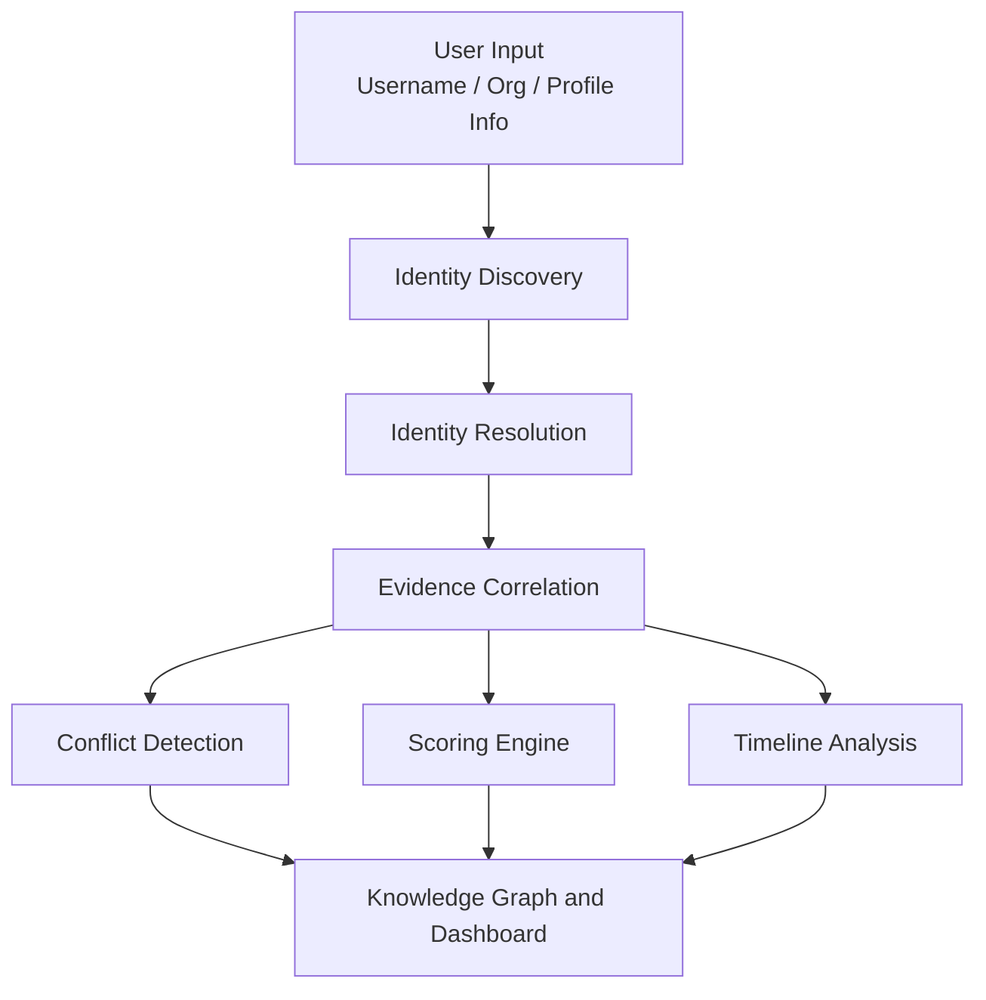

# Digital Identity Intelligence System

An AI-assisted platform for discovering, resolving, and analyzing public-source identity information across multiple online platforms.


---

## Table of Contents

- [Overview](#overview)
- [Key Features](#key-features)
- [System Architecture](#system-architecture)
- [Project Structure](#project-structure)
- [Technology Stack](#technology-stack)
- [Installation](#installation)
- [Usage](#usage)
- [Core Modules](#core-modules)
- [Output](#output)
- [Limitations](#limitations)
- [Responsible Use](#responsible-use)
- [License](#license)

---

## Overview

The system takes an identity input such as a **username**, **organization**, or **profile information** and builds a structured view of the discovered identity. It combines identity resolution, evidence correlation, conflict detection, confidence scoring, timeline analysis, and knowledge-graph visualization in a single interactive dashboard.

Instead of examining individual profiles manually, the whole analysis runs through one pipeline.

---

## Key Features

| Feature | Description |
| --- | --- |
| **Identity Discovery** | Finds public identity records from supported sources using a username, organization, or profile information |
| **Identity Resolution** | Decides which discovered profiles likely belong to the same person |
| **Evidence Correlation** | Collects profile records, source URLs, organizations, projects, publications, and public identifiers |
| **Conflict Detection** | Flags inconsistent names, organizations, locations, roles, or profile details |
| **Confidence Scoring** | Combines multiple signals into an overall confidence score |
| **Knowledge Graph** | Builds a relationship graph of the identity and its linked entities |
| **Identity Timeline** | Shows dated activity and events in chronological order |

### Resolution signals

- Username similarity
- Name similarity
- Organization
- Location
- Roles
- Projects
- Source agreement

### Confidence score components

- Username Match
- Image Match
- Source Agreement
- Record Linkage
- Organization Match
- Evidence Strength
- Conflict Detection

### Knowledge graph structure

```text
Person
   |
   +-- Username
   +-- Profiles
   +-- Platforms
   +-- Organizations
   +-- Roles
   +-- Projects
   +-- Publications
   +-- Locations
```

The graph is generated dynamically from the discovered identity data.

---

## System Architecture



---

## Project Structure

```text
digital-intelligence-system/
|
+-- app.py                 # Streamlit dashboard and pipeline
+-- requirements.txt
+-- README.md
+-- .gitignore
|
+-- modules/
|   +-- __init__.py
|   +-- discovery.py       # Candidate record discovery
|   +-- resolver.py        # Record matching and resolution
|   +-- evidence.py        # Evidence organization
|   +-- conflict.py        # Inconsistency detection
|   +-- scorer.py          # Confidence scoring
|   +-- timeline.py        # Chronological event building
|   +-- graph_builder.py   # Graph construction and rendering
|   +-- ...
|
+-- generated/
    +-- identity_graph_*.png
```

---

## Technology Stack

| Technology | Purpose |
| --- | --- |
| Python | Core application |
| Streamlit | Interactive web interface |
| NetworkX | Knowledge graph construction |
| Matplotlib | Graph visualization |
| Pandas | Data processing |
| Git / GitHub | Version control and hosting |

---

## Installation

**Prerequisites:** Python 3.9 or newer, and Git.

### 1. Clone the repository

```bash
git clone https://github.com/Nivedithakatta08/digital-intelligence-system.git
cd digital-intelligence-system
```

### 2. Create and activate a virtual environment

Windows:

```bash
python -m venv venv
venv\Scripts\activate
```

macOS / Linux:

```bash
python3 -m venv venv
source venv/bin/activate
```

### 3. Install dependencies

```bash
pip install -r requirements.txt
```

If `requirements.txt` is not available:

```bash
pip install streamlit networkx matplotlib pandas
```

### 4. Run the application

```bash
streamlit run app.py
```

The app opens in your browser, usually at `http://localhost:8501`.

---

## Usage

1. Enter a username or other supported identity information, for example:

```text
   Username: tanaypratap
```

2. Click **Analyze Identity**.
3. The system runs the pipeline: discovery, resolution, evidence analysis, then confidence and conflict analysis.
4. The dashboard displays:
   - Identified Person
   - Source Coverage
   - Confidence Score
   - Knowledge Graph
   - Identity Timeline
   - Evidence Components
   - Conflict Detection
   - Resolved Profile
   - Other Candidates

---

## Core Modules

| Module | Responsibility |
| --- | --- |
| `discovery.py` | Discovers candidate identity records from supported sources |
| `resolver.py` | Matches and resolves candidate records using identity attributes |
| `evidence.py` | Organizes supporting evidence for discovered identities |
| `conflict.py` | Detects inconsistencies between identity records |
| `scorer.py` | Calculates confidence from multiple identity signals |
| `timeline.py` | Builds a chronological view of identity events |
| `graph_builder.py` | Builds and renders the knowledge graph with NetworkX and Matplotlib |
| `app.py` | Streamlit dashboard that coordinates the full pipeline |

---

## Output

```text
Identity
|
+-- Source Coverage
+-- Resolved Profile
+-- Confidence Score
+-- Evidence
+-- Conflicts
+-- Timeline
+-- Related Profiles
+-- Knowledge Graph
```

The knowledge graph links the resolved identity to platforms, usernames, organizations, projects, publications, and locations. Generated graph images are saved in the `generated/` folder.

<!-- Add screenshots here once available:


-->

---

## Limitations

- Coverage depends on the public sources the discovery module supports.
- Confidence scores are heuristic. They indicate likelihood, not proof of identity.
- Common names and usernames can cause false matches, so results should be reviewed by a person.
- Public profile data may be outdated or incomplete.

---

## Responsible Use

This project is intended for **educational, research, and authorized public-source intelligence** use.

It should only process information that is legally accessible and appropriate to use. It must **not** be used to:

- Obtain private information
- Bypass access controls
- Impersonate individuals
- Facilitate harassment or unauthorized surveillance

Users are responsible for following each data source's terms of service and applicable privacy laws.

---

## License

This is an academic and hackathon project. (MIT License)
